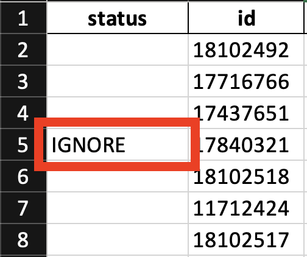

# SpareRoom Scraper

This is a Python tool for scraping rental listings from SpareRoom.co.uk, maintaining a local database of previously-seen rooms, filtering out expired listings, and exporting final results to Excel (and generating a map).

## Table of Contents

- Features
- Installation
- Usage
- License

## Features
- Searches SpareRoom listings within rent limits and other search preferences
- Identifies and processes new rooms
- Filters out expired listings
- Scores and ranks rooms
- Exports the results to an Excel file
- Saves and updates a local .pkl database
- Creates a map of all valid rooms

## Installation

```
# Clone the repository
git clone https://github.com/PatrickMiller164/spareroom

# Navigate to the project directory
cd spareroom-scraper

# Create and activate a virtual environment
python3.11 -m venv venv
source venv/bin/activate

# Install everything from the requirements.txt file
pip install -r requirements.txt

# Run the main.py file
python main.py
```

## Usage

### Calculating commute times
This scraper can also calculate commute times from the listing location to two locations. It does this using Google's Routes API. To enable this feature, create a Google Cloud account, go to the Google Maps Platform and click onto the Keys and Credentials page. Create an API Key for the Routes API and store the API Key in a .env file in the project directory. Additionally, add up to two pairs of coordinates with the following variable names.

Example `.env` file:
```
GOOGLE_API_KEY=<api_key>

L1_LAT=<float>
L1_LON=-<float>

L2_LAT=<float>
L2_LON=<float>
```

### General config
In the config.py file, each variable in the MAIN dictionary does the following
```
MAIN = {
    "check_for_expired_rooms": False,  # Filters out expired listings from database
    "headless": True,				# Enables/Disables the browser when scraping
    "number_of_pages": 1,           # Number of pages to scrape. There are 10 results per page, sorted by most recently added
    "min_rent": "200",      	    # Minimum rent parameter
    "max_rent": "900",			    # Maximum rent parameter
    "filename": "database.xlsx",	# Output filename (must be a .xlsx file)
}
```

### Tailoring the score system
The score system normalises each metric below between 0 and 1, 0 being the worst and 1 being the best. It then multiples each score by the value set in the SCORE_WEIGHTINGS dictionary. For example, currently the location_1 and average_price metrics impact the final score the most, while other metrics like garden_or_patio or broadband_included affect the final score the least. To tailor the scoring system to your prefernces, adjust the relative weighting of these metrics.
```
SCORE_WEIGHTINGS = {
    "direct_line_to_office": 1,
    "location_1": 5,
    "location_2": 4,
    "minimum_term": 1,
    "bills_included": 4,
    "broadband_included": 1,
    "garden_or_patio": 1,
    "living_room": 3,
    "balcony_or_rooftop_terrace": 1,
    "total_number_of_rooms": 2,
    "gender": 1,
    "average_price": 5,
    "furnishings": 2
}
```

### Deleting listings from the output file
To permanently remove listings from the excel output file, rename the value in the status column to 'IGNORE'. Permanently removed listings have their id's stored in the `data/ignored_ids.json` file. To revert a deletion, remove the id from the json file.



## License
This project is licensed under the MIT License.